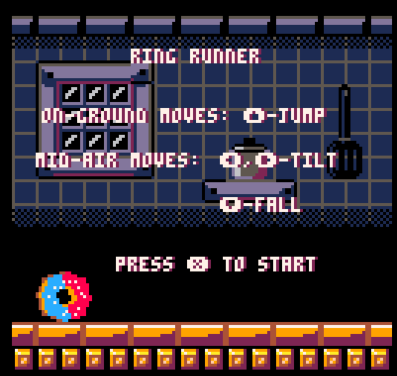
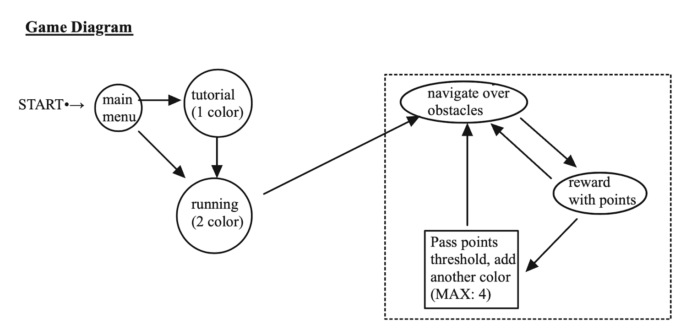

### Game Design Document (GDD) for Ring Runner
---

### Table of Contents
- [Ring Runner](#ring-runner)
  - [1.0 Summary](#10-summary)
  - [2.0 Game Overview](#20-game-overview)
    - [2.1 References](#21-references)
    - [2.2 Terminology](#22-terminology)
    - [2.3 Game Flow Chart](#23-game-flow-chart)
  - [3.0 Objects/Components](#30-objectscomponents)
    - [3.1](#31)
  - [4.0 Gameplay](#40-gameplay)
    - [4.1](#41)
  - [5.0 Questions and Additional Ideas](#50-questions-and-additional-ideas)
    - [5.1 Questions](#51-questions)
    - [5.2 Additional ideas](#52-additional-ideas)
  - [6.0 Appendix](#60-appendix)
    - [References](#references)

# Ring Runner

An endless runner game crafted for the PICO-8 platform, featuring a donut that speeds through an obstacle course filled with springs, ramps, and spikes. The aim is to survive as long as possible by relying on quick reflexes, skill, and wit.

## 1.0 Summary

Ring Runner combines the charm of retro gaming with the thrill of modern endless runners, creating a unique and engaging experience. As a donut, the player rolls through an ever-changing track, encountering various obstacles that require precise movements and quick reflexes to overcome. The game's design emphasizes constant engagement, ensuring that players are always on their toes, ready to react to new challenges.

### Player Experience

The core experience is designed to keep players engaged and constantly involved in the game's action. We aim for the player to feel a continuous sense of progression and achievement, with each moment in the game offering a new challenge to overcome. The twitch action controls ensure that the player is always anticipating and reacting, providing a satisfying loop of action and reward.

### Core Design Values
<!-- What are your core design values? -->
- **Retro**: Ring Runner pays homage to the classic arcade and early console games, both in its pixel art aesthetics and in its straightforward, yet challenging gameplay mechanics. The PICO-8 platform is chosen specifically to enhance this retro feel, limiting the game's visual and technical aspects to what could be achieved with older hardware.

- **Fast-Paced**: The game is designed to keep players on the edge of their seats. The track speeds up as the player progresses, increasing the difficulty and requiring faster reflexes. This design choice ensures that the game remains challenging and engaging over time.

- **Reflex-Based**: Success in Ring Runner depends on the player's ability to quickly respond to obstacles and changing patterns on the track. The game rewards sharp reflexes and penalizes hesitation, pushing players to improve their reaction times and adapt to new obstacles and challenges.

### Desired Player Feel
<!-- You should also discuss here how you want the player to feel. -->
Ring Runner aims to immerse players in a flow state, where they are fully absorbed in the game's challenges, reacting instinctively to obstacles, and experiencing a deep sense of satisfaction with each successful maneuver. The goal is for players to come away feeling exhilarated by their ability to navigate the complex track, motivated to improve their skills and achieve higher scores.

By combining these core design values, Ring Runner strives to offer a compelling and addictive gameplay experience that appeals to fans of retro games and endless runners alike. The game's design ensures that players have a clear understanding of its mechanics from the outset, while the increasing difficulty and variety of obstacles keep the gameplay fresh and exciting.

---

## 2.0 Game Overview

### 2.1 References
<!-- What games are similar to your game? What are you referencing in your designs? You can use your competitive research homework here. Competitive research helps you as the designer know what you are going for, as well as for anyone reading your doc. If they are familiar with the game, you are referencing this immediately clues them in to what you want to do. -->
Ring Runner draws inspiration from a blend of classic and modern games, combining elements of rapid gameplay, precise control demands, and unique thematic settings to create an engaging experience. Two primary references stand out in the development and conceptualization of Ring Runner:

- **Geometry Dash**: Similar to Geometry Dash, Ring Runner challenges players with a side-scrolling obstacle course that requires precise timing and quick reflexes. The aesthetic simplicity, alongside the concept of navigating through geometric obstacles, is a core similarity. While Geometry Dash focuses on rhythm-based levels with a cube protagonist, Ring Runner introduces a playful twist with a rolling donut navigating through a kitchen-themed obstacle course.

- **Sonic the Hedgehog (Sega Genesis)**: The fast-paced action and platforming elements of the original Sonic the Hedgehog games heavily influence Ring Runner's design. Like Sonic, players must make split-second decisions to avoid obstacles and navigate through the levels. The inclusion of springs and ramps in Ring Runner is a nod to the classic Sonic mechanics, allowing for dynamic movements and exciting gameplay. However, Ring Runner incorporates a unique mechanic of color matching with springs, adding an additional layer of strategy to the fast-paced action.

Through these inspirations, Ring Runner aims to capture the essence of engaging platformers and endless runners, while offering a fresh and distinctive gameplay experience rooted in the nostalgia of classic games.

### 2.2 Terminology
<!-- If you have any made up terminology in your game, or you are using words in a different way than we would expect them to be used this a place where you can identify that. -->
Understanding the unique elements of Ring Runner is essential for players to navigate the game effectively. Here are some specific terms used within the game:

- **Match Spring**: A core mechanic of Ring Runner, Match Springs are special platforms that can either aid or hinder the player's progress. When the player's donut lands on a spring with icing that matches the spring's color, the donut is propelled forward, allowing the player to bypass obstacles and continue their run. However, if the icing color does not match the spring's color, the player will not be able to use the spring, leading to potential game-ending scenarios. This mechanic encourages players to strategize their movements and adds a layer of complexity to the gameplay.

By incorporating these elements, Ring Runner sets itself apart from other games in the genre, offering players a unique challenge that combines speed, strategy, and quick reflexes.

### 2.3 Game Flow Chart
<!-- You will put your games flow chart here to show the flow of your game. From this flow chart you can define the main actions, objects, and rules that you will need to explain more in detail. -->

## 3.0 Objects/Components
<!-- In this section you would break down the objects of your game that need to be detailed out. For example, if your game is a card game you would detail the cards here.  Or if it was a board game maybe you would have a section showing the board layout and considerations for the board we need to keep in mind, as well as maybe one for the player tokens etc. -->
- C - Complete
- IP - In Progress
- NYI - Not yet Implemented
#### 3.1 Player
- **Donut (IP)**: The central character of the game is a whimsically animated donut. As it moves, the donut exhibits a rolling motion that mimics real-world physics, enhancing the game's immersion. The donut's ability to jump is crucial for navigating obstacles. Future enhancements may include customizable skins or effects that players can unlock, adding a personal touch and encouraging continued play to collect these variations.

#### 3.2 Obstacles
- **Spikes (IP)**: Spikes present a lethal challenge to players. They are designed with a visually sharp appearance to be easily identifiable as a hazard. Spikes will be placed strategically across the course to challenge players' timing and precision in jumping.
  
- **Spike Walls (NYI)**: Intended as moving or stationary barriers adorned with spikes, these walls will require players to either stop, change direction, or find a path over or around them. Their implementation will add a layer of complexity to the gameplay, offering new challenges and diversifying the obstacle set.

#### 3.3 Helpful Objects
- **Springs**: Bouncing on a spring will make a *\*Boing\** sound, but bouncing on several in a row will result in a cute little noise (this signals to the player they have succeeded in their streak)
  - **Match Springs (IP)**: Springs that match the color of the player's donut will provide a significant bounce, propelling the player forward or upward. The mechanic of forcing oneself downward to achieve a bigger bounce introduces an additional skill element, rewarding timing and precision with enhanced mobility. 

  - **Safe Springs (NYI)**: These springs, distinguishable by their unique color or design, offer a safe bounce regardless of the player's color. They will serve as a strategic element, especially in sections with a high density of obstacles, providing a temporary reprieve or assisting in difficult jumps.
- **Ramps (NYI)**: Ramps will accelerate the player upon contact, launching them into the air. The design will consider different angles and lengths to provide varying levels of momentum and challenge. Ramps can be used to introduce aerial segments, adding variety to the gameplay and offering players new ways to navigate levels.

#### 3.4 Collectibles
- **Super Icing (NYI)**: This power-up temporarily transforms the player's donut into a white color, allowing it to interact with any spring regardless of its color. The Super Icing will be a rare collectible, visually distinct to stand out to the player. Its temporary nature and strategic advantage will encourage players to make the most of its effects, adding a layer of tactical decision-making to the game.

## 4.0 Gameplay
<!-- In this section you would start going through all the considerations in the flow of your gameplay. Consider: What can the player do? Are their turns? What can players do on their turns? This is probably going to be the meatiest section of your GDD and should cover how the game is supposed to run, and potential edge cases. -->
<!--### 4.1 Players Moves
 On a player’s turn they can take one of three following actions: 
- d.	Discard Cards and Draw up to their Hand Limit
  Here is where I would describe what it means to discard (Players can add cards to the discard deck.) I also mentioned a Hand Limit…what is that? How many cards is in the hand limit? Is that something I should put in the components section?  
- e.	Play a Pair
  What does it mean to play a pair? Where do pairs go? Does something happen when you play a pair? 
- f.	Trade Cards with an Opponent
  You get the gist of it now, right? (Unfortunately, yes GDDs require detail!) Usually when I am writing a GDD I do a lot of hopping around between sections. I might move info from the gameplay section into the components section or vice versa.*
-->
### 4.1 Players Moves
In "Ring Runner," the player has a dynamic set of moves to navigate through the game's challenges. These moves are designed to provide a satisfying and responsive control scheme that rewards skill and timing.

- **Ground Move**
  - **Jump (⬆️ or 🅾️)**: When on the ground, the player can press the up arrow or the circle button to make the donut jump. This move is crucial for avoiding ground obstacles like spikes and for reaching Match Springs.

- **Mid-air Moves**
  - **Tilt Backwards (⬅️)**: While in the air, pressing left allows the player to tilt backwards. This move can adjust the landing position, crucial for aligning with the correct color on Match Springs or avoiding mid-air obstacles.
  - **Tilt Forwards (➡️)**: Pressing right tilts the player forwards, offering similar strategic adjustments as tilting backwards but in the opposite direction.
  - **Fast Fall (⬇️)**: Increases the player's downward velocity, allowing for quicker descents. This move is useful for rapid adjustments or to quickly reach the ground for the next jump.

- **Streak Bonus**: Successfully jumping on consecutive springs without missing increases the player's streak count, which in turn extends the window of time available for executing Mid-air Moves. This mechanic rewards precision and consistency with enhanced control and maneuverability.

### 4.2 Obstacle Mechanics
Obstacles in "Ring Runner" are designed to test the player's reflexes, precision, and strategic use of their moves.
- **Spikes** : Touchings spikes results in a player death / gameover. The death animation includes a harsh noiseplayer will bouncing up in the air (but won't be able to move) as they 
  - **Spike Pit**: Encountering spikes results in an instant game over, emphasizing the need for careful navigation.
  - **Spike Walls**: These stationary or moving walls covered in spikes add a layer of complexity, requiring timely jumps or mid-air maneuvers to avoid. 
- **Match Springs**: Color-coded springs that require the player to match their color to bounce. Incorrect matches lead to failed jumps, adding a strategic layer to the gameplay.
- **Safe Springs**: These springs allow a bounce regardless of color, providing strategic points of relief in the game's courses.

### 4.3 Point System
The point system in "Ring Runner" rewards survival time and skillful play.

- **Survival Points**: Points are accumulated over time, with the rate slowing down as the game progresses. This mechanic ensures that the game remains challenging and that players must strive to survive as long as possible to achieve high scores.
- **Streak Bonuses**: Consecutive successful jumps on Match Springs without failing or hitting obstacles grant bonus points, incentivizing skillful and precise gameplay. The sound associated with jumpin on spikes also changes as the streak increases. They start as silly spring sounds, but will turn into positive (almost coin like) sounds as the player continues. 
- **Collectibles**: Gathering Super Icing or other collectibles can provide point bonuses, adding an element of exploration and risk-reward to the game.

## 5.0 Questions and Additional Ideas
<!-- This is a kind of free-from section that I include in a lot of my personal project documentation. It’s useful for projects that are ongoing with a living doc, or things that need to be tested out.  -->
### 5.1 Questions
<!-- In this section I like to identify any questions I have about my design or that I will need to answer to execute my design. When I am working on the doc sometimes I will jot little footnotes down here that need to be included in a section (ie What do players do if they run out of cards?) This reminds me to get that edge case detailed up.  -->

### 5.2 Additional ideas.
<!-- This is where I jot down ideas I might want to explore with this game/system in the future. This is only useful if I am using this doc on an ongoing basis, and I plan to come back to it and make edits. -->

#### Difficulty settings:
- As of now, we have a difficult setting where the player gains more colors as the game progresses. I may include a selector for this difficulty setting on the title screen. (i.e. if players want to start with more colors from the start they can do so).

#### Game Goals / Levels:
- i'm considering adding other levels to the game, with different backgrounds, floor tiles, and difficulties to them. 
- I may decide to change the goal of the game (this would build on the level Part) alongside the endless run mode I may include a story mode in which case, here is the story: You're a donut and your want to be eaten. You're rolling through a series of obstacles and crazy environments in the hopes that you roll into the mouth that eats you. 

## 6.0 Appendix
### References
<!-- This section is for linking other relative documentation or resources needed. -->