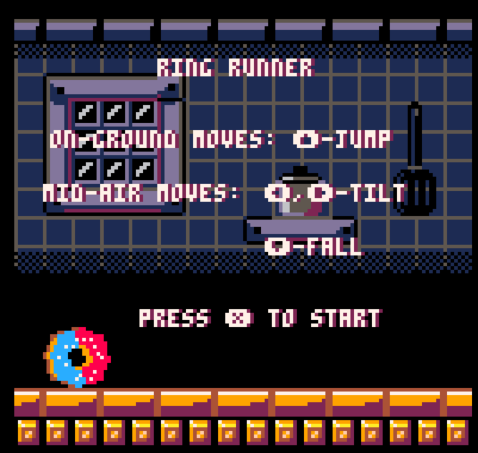

# 2-18-24 Entry
## Summary
*Two Sentences: What your game is. What are your design values. This should be your elevator pitch.*

Ring Runner is a fast paced, reflex based, 2D endless runner where the player is a donut rolling on a track. They interact with obstacles where player’s movements in response determine the game outcome.

## Playtest Rules and Parameters

### The Win Condition
There is no win condition in this game. It's a challenge of endurance for the player, survive as long as possible. 

### Actions
The player is a donut rolling on a track. While rolling on the ground, the player can jump. While in the air, the player may orient themselves forward or backwards and move faster in the downward direction. 

### Obstacles and Objects
The player must evade obstacles and survive for as long as possible:
- **Springs** Jumping on springs with the same color as donuts icing will give the player an extra jump  
- **Spikes** If you land on a spike, you die. 
- **Spike wall** running into a spike wall will kill you. 
- **Ramps** Rolling down a ramp will speed the player up and give them some air time. 
- **Platforms** can jump onto platforms with springs. Platforms and ramps go hand in hand.
  - *Idea*
- **NOT YET IMPLEMENTED-Coins** Thinking of having coins to help guide the player

## What Happened During the Playtest
I decided to change something about the control scheme. Instead of making a jump button, that was separate from the d-pad, I made 'up' the jump button. 

### What was working? 
I think the moments mid-air still felt pretty fun. I have ofcourse nixxed the original difficulty as springs of a different color no longer kill you. However, I did begin to feel like There was more potential for a universal appeal.

### What is not working as I intend it (Challenges to be solved?) 
I'm still not 100% certain about how the controls feel. I do think using a new control scheme helped me play the game from a fresh perspective. I imagine this would be how people just trying out my game for the first time would feel. So I'll need some feedback from my peers who have played it on whether this is more intuitive or not.

### What will I try next? 
I'm going to have some other people playtest the game. 
- I think I might take out the rule where you need to land and orient yourself to match the spring color. I might keep something color based (i.e. you need to have the color to actually jump on the spring) but I'll make the colors collectable throughout the level. I'll make te 
- Still need to add the logic for spikes. 
- Considering adding coins. This might help guide the player especially in the tutorial phases so that they can get a better sense of how they should move.
- I'm thinking about having some new springs. Some white springs that you can jump on anytime. rather than starting out red, you start out white, the red springs will be introduced later.

## Playtest Picture

