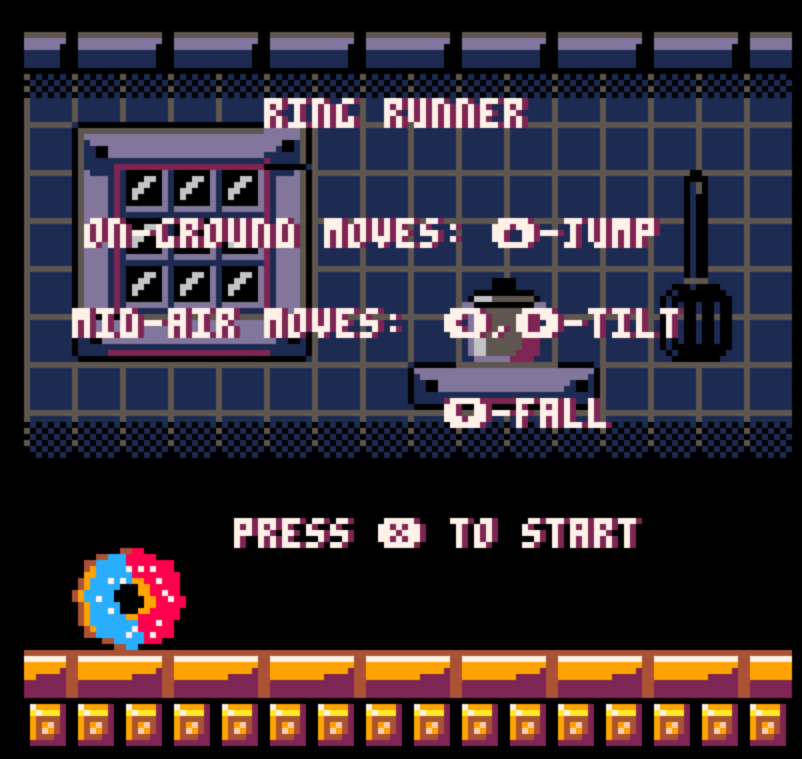

# 2-18-24 Entry
## Summary
*Two Sentences: What your game is. What are your design values. This should be your elevator pitch.*

Ring Runner is a fast paced, reflex based, 2D endless runner where the player is a donut rolling on a track. They interact with obstacles where player’s movements in response determine the game outcome.

## Playtest Rules and Parameters

### The Win Condition
There is no win condition in this game. It's a challenge of endurance for the player, survive as long as possible. 

### Actions
The player is a donut rolling on a track. While rolling on the ground, the player can jump. While in the air, the player may orient themselves forward or backwards and move faster in the downward direction. 

### Obstacles and Objects
The player must evade obstacles and survive for as long as possible:
- **Springs** Jumping on springs with the same color as donuts icing will give the player an extra jump  
- **NOT YET IMPLEMENTED-Spikes** If you land on a spike, you die. 
- **NOT YET IMPLEMENTED-Spike wall** running into a spike wall will kill you. 
- **NOT YET IMPLEMENTED-Ramps** Rolling down a ramp will speed the player up and give them some air time. 
- **NOT YET IMPLEMENTED-Platforms** can jump onto platforms with springs. Platforms and ramps go hand in hand.
  - *Idea*
- **NOT YET IMPLEMENTED-Coins** Thinking of having coins to help guide the player

## What Happened During the Playtest
I decided to change something about the control scheme. Instead of making a jump button, that was separate from the d-pad, I made 'up' the jump button. 

### What was working? 
I think the moments mid-air still felt pretty fun. I have ofcourse nixxed the original difficulty as springs of a different color no longer kill you. However, I did begin to feel like There was more potential for a universal appeal.

### What is not working as I intend it (Challenges to be solved?) 
I'm still not 100% certain about how the controls feel. I do think using a new control scheme helped me play the game from a fresh perspective. I imagine this would be how people just trying out my game for the first time would feel. So I'll need some feedback from my peers who have played it on whether this is more intuitive or not.

### What will I try next? 
I'm going to have some other people playtest the game. 
- I think I might take out the rule where you need to land and orient yourself to match the spring color. I might keep something color based (i.e. you need to have the color to actually jump on the spring) but I'll make the colors collectable throughout the level. I'll make te 
- Still need to add the logic for spikes. 
- Considering adding coins. This might help guide the player especially in the tutorial phases so that they can get a better sense of how they should move.
- I'm thinking about having some new springs. Some white springs that you can jump on anytime. rather than starting out red, you start out white, the red springs will be introduced later.

## Playtest Picture

---

# 2-19-24 Entry
## Summary
*Two Sentences: What your game is. What are your design values. This should be your elevator pitch.*

Ring Runner is a fast paced, reflex based, 2D endless runner where the player is a donut rolling on a track. They interact with obstacles where player’s movements in response determine the game outcome.

## Playtest Rules and Parameters

### The Win Condition
There is no win condition in this game. It's a challenge of endurance for the player, survive as long as possible. 

### Actions
The player is a donut rolling on a track. While rolling on the ground, the player can jump. While in the air, the player may orient themselves forward or backwards and move faster in the downward direction. 

### Obstacles and Objects
The player must evade obstacles and survive for as long as possible:
- **Springs** Jumping on springs with the same color as donuts icing will give the player an extra jump
- **Spikes** If you land on a spike, you die.
- **NOT YET IMPLEMENTED-Ramps** Rolling down a ramp will speed the player up and give them some air time. 
- **NOT YET IMPLEMENTED-Platforms** can jump onto platforms with springs. Platforms and ramps go hand in hand.
- **NOT YET IMPLEMENTED-Coins** Thinking of having coins to help guide the player

## What Happened During the Playtest
After some adjustments, I had a friend of mine (who never played it before) try it out with the new controls. It seems like they were able to grasp it fairly well. I also started the game out with a single color donut, rather than the dual colored donut, that seemed to help get the player's accustomed to the controls.
- *Idea*: maybe instead of having the tutorial, I will make the players have to use the controls of tilting somewhere before they actually would need it.

### What was working? 
We're still going to keep the existing controls, they seem to be more intuitive.
I also got the spikes to start working, they aren't super great but they work.

### What is not working as I intend it (Challenges to be solved?) 
Needed:
- I need to make a more robust system for generating springs in relation to spikes.   
- Have yet to implement the ramps
- Have yet to implement the platforms to jump onto
- Have yet to implement the platforms to jump onto
Wanted:
- Have yet to implement a coin system
- Still want to add Parallax scrolling

### What will I try next? 
- i'm going to make a more robust system for generating spikes, I think I'll also 
- I want to work on expanding on the points system, I'll look at something like tetris in how it scores it's points based on it's moves. 

## Playtest Picture

---

# 2-19-24 Entry
## Summary
<!-- *Two Sentences: What your game is. What are your design values. This should be your elevator pitch.* -->

Ring Runner is a fast paced, reflex based, 2D endless runner where the player is a donut rolling on a track. They interact with obstacles where player’s movements in response determine the game outcome.

## Playtest Rules and Parameters

### The Win Condition
There is no win condition in this game. It's a challenge of endurance for the player, survive as long as possible. 

### Actions
The player is a donut rolling on a track. While rolling on the ground, the player can jump. While in the air, the player may orient themselves forward or backwards and move faster in the downward direction. 

### Obstacles and Objects
The player must evade obstacles and survive for as long as possible:
- **Springs** Jumping on springs with the same color as donuts icing will give the player an higher jump
- **Spikes** If you land on a spike, you die.
- **NOT YET IMPLEMENTED-Ramps** Rolling down a ramp will speed the player up and give them some air time. 
- **NOT YET IMPLEMENTED-Platforms** can jump onto platforms with springs. Platforms and ramps go hand in hand.
- **NOT YET IMPLEMENTED-Coins** Thinking of having coins to help guide the player

## What Happened During the Playtest
I made some slight adjustments here, I wasn't able to implement everything I wanted to as of yet. I changed the scoring system, such that if the player has less colors on their donut, the score does not increase as much. This allows players to get accustomed to the controls on a single color, before moving into the 2 colors.
After some adjustments, I had a friend of mine (who never played it before) try it out with the new controls. It seems like they were able to grasp it fairly well. I also started the game out with a single color donut, rather than the dual colored donut, that seemed to help get the player's accustomed to the controls.
- *Idea*: maybe instead of having the tutorial, I will make the players have to use the controls of tilting somewhere before they actually would need it.

### What was working? 
I added parallax scrolling which looked nice. I also changed some of the jumping mechanics, making it easier for players to tilt while in the air

### What is not working as I intend it (Challenges to be solved?)
Needed:
- The hit detection for the springs need some work. 
- Before I go full blown on implementing a tutorial section, I'm thinking I might add a little sign that says tilt permanently on the screen.
  - Players intuitively get that up is jump and down is fall. But the tilt has some getting used to. 
  - The game is simple enough at the start, but the 2 colors really add a difficulty spike 
    - *Idea*: after implementing coins, make some other coins that can only be collected while spinning. 
- I need to make a more robust system for generating springs in relation to spikes.   
- Have yet to implement the ramps
- Have yet to implement the platforms to jump onto
Wanted:
- Have yet to implement a coin system

### What will I try next? 
- Add a more robust Spike/spring generation system.

## Playtest Picture

